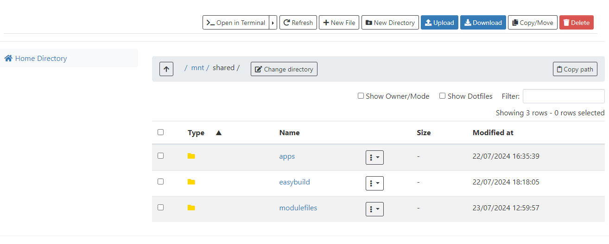
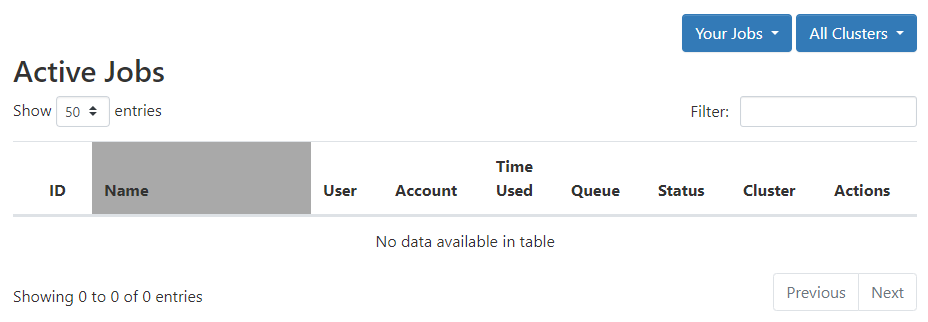
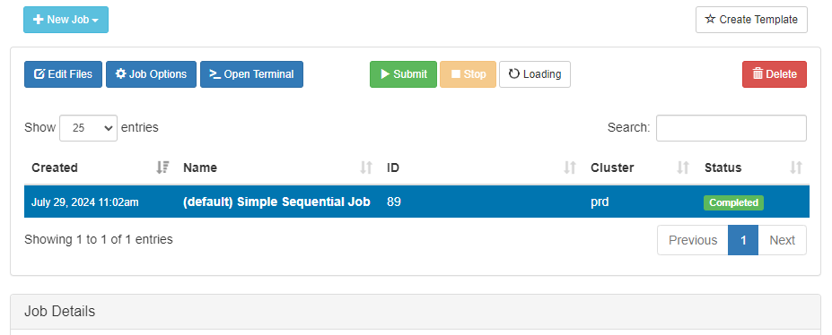
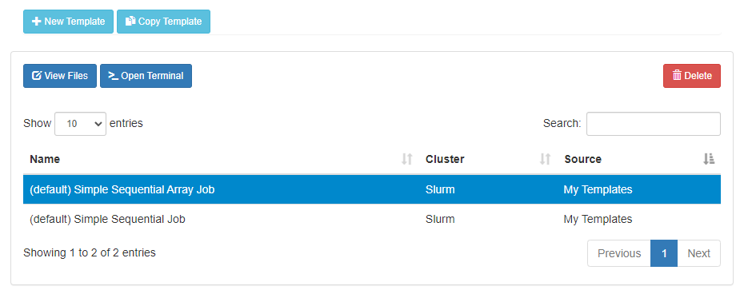
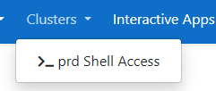
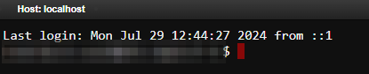
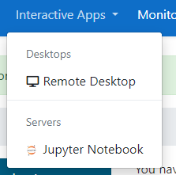

<!-- PROJECT SHIELDS -->
<!--
*** I'm using markdown "reference style" links for readability.
*** Reference links are enclosed in brackets [ ] instead of parentheses ( ).
*** See the bottom of this document for the declaration of the reference variables
*** for contributors-url, forks-url, etc. This is an optional, concise syntax you may use.

[![Contributors][contributors-shield]][contributors-url]
[![Forks][forks-shield]][forks-url]
[![Stargazers][stars-shield]][stars-url]
[![Issues][issues-shield]][issues-url]

<!-- PROJECT LOGO -->

  

  <h3 align="center">Artemis Exercises #1</h3>
  

    This first set of exercise will get you logged into the Open OnDemand Web Portal and Navigate you through each Service.
  

    <a href="https://github.com/universityofsussex-its/RC-Workshops"><strong>Go Back to Splash »</strong></a>
     

<!-- TABLE OF CONTENTS -->

  
Exercises

  <ol>
    <li><a href="#login">Login</a></li>
    <li><a href="#landing-page">Landing Page</a></li>
    <li><a href="#files">Files</a></li>
    <li><a href="#jobs">Jobs</a></li>
    <li><a href="#clusters">Clusters</a></li>
    <li><a href="#interactive-apps">Interactive Apps</a></li>
    <li><a href="#monitoring">Monitoring</a></li>
    <li><a href="#summary">Summary</a></li>
  </ol>

(<a href="#top">back to top</a>)

## Login

  Access to the Artemis Hybrid Research Cluster (HRC) will primarily be via your browser, and if off campus, using the VPN. If you currently do not have access to the VPN - you will need to request as such, and to be added to the relevant departmental group in Palo Alto. It is assumed you either have access now, or are on campus.    

### Open OnDemand

You will need to access the Open OnDemand Web Portal - via ood.artemis.sussex.ac.uk (if available) or using 139.184.83.139. You will need to login with the test user currently (eventually you will use your Sussex credentials but currently only a demo account is available). Please ask the Intructor for these credentials.

### SSH

Similarly to the old Apollo2 HPC, Artemis has login nodes for direct command line access to the cluster. Currently this is not available but will be reachable by the same methods as Apollo2. See Basic Exercises if not familiar with Bash and SSH logins.

## Landing Page

The landing page should look like:

This page will display various message of the day, will have common apps and services pinned to the bar, and have navigation links to our documentation site https://artemis-docs.hrc.sussex.ac.uk (not currently available).

In the navigation bar at the top you have the following options:

<ul>
<li>
  <h4>Prd:</h4>
  

  Clicking this will navigate to the Open OnDemand (OOD) landing page.
  

</li>
<li>
  <h4>Files:</h4>
  

  Opens a dropdown menu with links to access the files and folders in your attached storage/home directory on the HRC.
  

</li>
<li>
  <h4>Jobs:</h4>
  

  Opens the Jobs dropdown which has navigatable links to the Active Jobs monitoring page, and the Jobs Composer - which allows you to craft batch jobs in the browser from templates and previous jobs.
  

</li>
<li>
  <h4>Clusters:</h4>
  

  Opens cluster selection dropdown. Access to the Login nodes commandline of the production or other project based clusters. (Currently only the production cluster)
  

</li>
<li>
  <h4>Interacitve Apps:</h4>
  

  Opens the app selector. Currently has two options - Jupyter Notebooks and Remote Desktop (XFCE).
  

</li>
<li>
  <h4>Monitoring:</h4>
  

  This will provide links to dashboard powered by Prometheus and Grafana. This can be used to monitor cluster usage, load, jobs, job resource consumtion, downtime etc. 
  

</li>
<li>
  <h4>Two Blocks Icon:</h4>
  

  Clicking this will navigate to the "My Interactive Session" - this page lists any sessions launched from the Interactive Apps drop-down.
  

</li>
<li>
  <h4>Options:</h4>
  

   Opens a dropdown menu which will provide links to the ticketing service, online documentation. This option also includes a Restart Web Server option which will refresh you session.
  

</li>
<li>
  <h4>Logout Logo:</h4>
  

  Quite simple really - the logout and close session. You might need to clear cookies for the account to completely logout.
  

</li>

</ul>

(<a href="#top">back to top</a>)

## Files

The Files menue allows exploration, edit, upload of files and folders into the HRC environment. 

Currently only the workshop home directory and the software mounts will be available. 

One the remote storage systems have been integrated, you will be able to access any mounted network drive, including Lustre.

### Files Excercises

   1. Workshop Working Directory:

      As the workshop today is using a shared user account on Artemis - you will need to navigate to the `/home/<user>/RSE-TOP/` directory. 
    
      1. Make a directory inside `/home/<user>/RSE-TOP/` which will be your work directory for the duration of the Workshop only. At the end of the Workshop you can download the folder if needed. We will refer to this directory as `workdir`.

      1. Navigate into your `workdir` and upload a **small** file from your desktop. 

      1. Navigate back up to the `RSE-TOP` folder and click the checkbox next to your `workdir`. Now download. You should download a zip containing your uploaded file.

      1. Copy your current path using the `copy path` button. Now Change directory to the shared software directory `/mnt/shared`. 

      1. Create a file `README.txt` in your workdir. Click the three dots next to your new file and edit. Write a brief explination of what the contents of this folder will contain for future reference. Don't forget to click save in the top-left.

      1. Change back to your `workdir` by pasting the copied path from earlier. Make two directories in your workdir `Jobs` and `Templates`. You might need these later to save your work after the workshop.

(<a href="#top">back to top</a>)

## Jobs

2.  Navigating the Jobs Pages.

    1. Navigate to the Active Jobs page via the Jobs dropdown menu in the navigation bar. 

        You should see somthing like:

        

        This page lists any active job in the queue, with selection for each cluster, and allows the user some basic filter options. Depending on the current progress of other users in the Workshop - you may or may not see some jobs active.

    2. Navigate to the Jobs Composer via the same dropdown menu in the navigation bar.

        This will either redirect or open a new tab and you should see a page similar to:

        

    3. Navigate in the new grey navigation menu to `Templates` - again you should see something similar to:

        

    4. Either close the tab, or click the `Open OnDemand` in the top right to navigate back to the Dashboard.

(<a href="#top">back to top</a>)

## Clusters

3. Artemis Browser Shell

    1. Using the `Clusters` dropdown - start an interactive shell session on one of the production cluster login nodes.

        

        You should now have a command line shell on one of the `prd-login-X` nodes.

        

    2. Navigate to your `workdir`. 

    3. Test out the `module` command and load a package. 

(<a href="#top">back to top</a>)

## Interactive Apps

This dropwdown provides access to one of the key tools that Open OnDemand will provide that was lacking in the Apollo2 HPC. Currently available are a Remote-Desktop tool provided by XFCE and a Jupyter Notebook server.

## Monitoring

Provides Dashboards for project owners. Not for use during this Workshop.

## Summary

Hopefully now you have a brief overview of what the Open OnDemand Web Portal can provide in terms of access to the cluster. 

The rest of the exercises in this workshop will focus on the user of the Jobs and Interactive sessions services provided by OOD. 

 You should now have an understanding of:

 - File access:
    - Navigation
    - Creation
    - Edit
    - Uploads
    - Downloads
 - Navigation Dropdowns
    - Files
    - Jobs
    - Cluster
    - Interactive Apps
 - Accesing the Artemis Login Nodes via in Browser Shell

<!-- MARKDOWN LINKS & IMAGES -->
<!-- https://www.markdownguide.org/basic-syntax/#reference-style-links -->
[contributors-shield]: https://img.shields.io/github/contributors/universityofsussex-its/RC-Workshops.svg?style=for-the-badge
[contributors-url]: https://github.com/universityofsussex-its/RC-Workshops/graphs/contributors
[forks-shield]: https://img.shields.io/github/forks/universityofsussex-its/RC-Workshops.svg?style=for-the-badge
[forks-url]: https://github.com/universityofsussex-its/RC-Workshops/network/members
[stars-shield]: https://img.shields.io/github/stars/universityofsussex-its/RC-Workshops.svg?style=for-the-badge
[stars-url]: https://github.com/universityofsussex-its/RC-Workshops/stargazers
[issues-shield]: https://img.shields.io/github/issues/universityofsussex-its/RC-Workshops.svg?style=for-the-badge
[issues-url]: https://github.com/universityofsussex-its/RC-Workshops/issues
