

<!-- PROJECT SHIELDS -->
<!--
*** I'm using markdown "reference style" links for readability.
*** Reference links are enclosed in brackets [ ] instead of parentheses ( ).
*** See the bottom of this document for the declaration of the reference variables
*** for contributors-url, forks-url, etc. This is an optional, concise syntax you may use.

[![Contributors][contributors-shield]][contributors-url]
[![Forks][forks-shield]][forks-url]
[![Stargazers][stars-shield]][stars-url]
[![Issues][issues-shield]][issues-url]

<!-- PROJECT LOGO -->

  

  <h3 align="center">Artemis Exercises #3</h3>
  

    This third set of exercise will get you logged into the Open OnDemand Web Portal and exploring the Interactive Applications.
  

    <a href="https://github.com/universityofsussex-its/RC-Workshops"><strong>Go Back to Splash »</strong></a>
     

<!-- TABLE OF CONTENTS -->

  
Exercises

  <ol>
    <li><a href="#remote-desktop">Remote Desktop</a></li>
    <li><a href="#jupyter-notebook">Jupyter Notebook</a></li>
  </ol>

(<a href="#top">back to top</a>)

The biggest game changer when it comes to the Open OnDemand Web portal is the ability for the ITS Platforms - Research Team to add default applications and services such as Jupyter notebooks and Labs, Remote Desktop, Matlab and Rstudio Servers. 

These first 4 were the most numerous service requests the team has received in the last 5 years. 

We hope to expand these services out as demand and the Research Teams skills develop.

NOTE: We are not sure how well the system will handle multiple people using the same account for remote-desktop applications... Have patience and flag an Instructor if you run into weirdness!

## Remote Desktop

This service will replace the extremely old and deprecated Exceed OnDemand client and server. This was primarily used for Graphical rendoring and we expect the XFCE Remote Desktop App to be used in a similar way.

We do not invisage Artemis being used as a permenant Desktop for users, as we do not have the capacity or the storage to provide that kind of service... yet :D

This service is expected to be used with 3D rendering software used in Chemistry, FSLeyes in Neuro etc. Interactive, 3D GUI.

If theres is a "Desktop Application" software you'd like as basic - you would request it via the usual Service Request - ITS HELP portal.

### Exercises

1. Starting a XFCE Remote Desktop Session

    If you aren't already on it, you'll need to navigate back to the Dashboard.

    Select Interactive Apps -> Desktop -> Remote Desktop.

    You should see a page like this:

    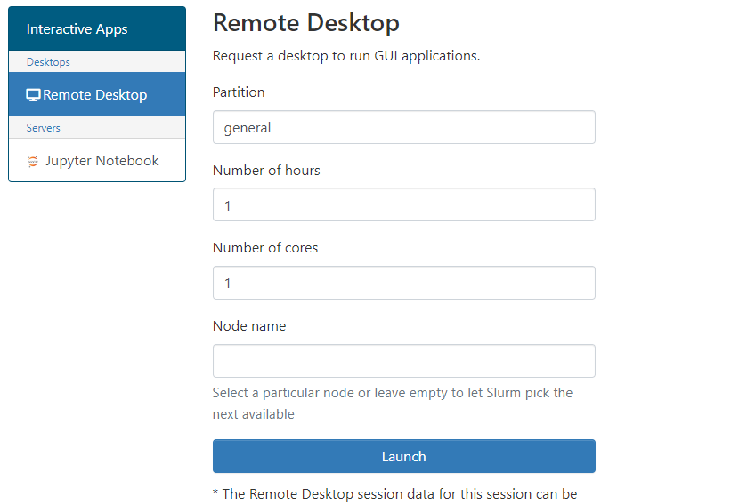

    Do not change these options for this exercise.

    You can also navigate to this page by clicking the  Icon -> Remote Desktop:

    Click Launch.

    You should now have something that looks like this:

    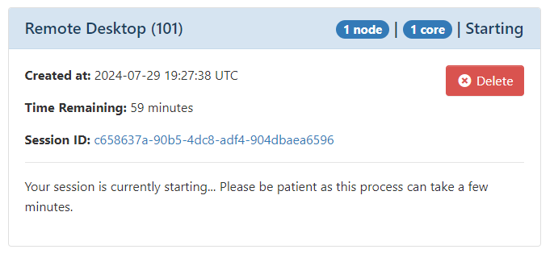

    Once this completes and the job starts you should get something like this:

    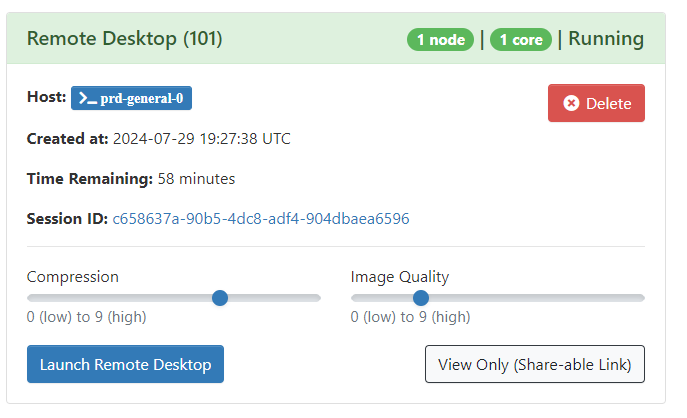

    If you're internet runs at the speed of a sloth in high winds after a night out in Revenge, you can increase the compression and decrease the Image Quality to reduce the network bandwidth and letnecy.

    Additionally, if working remotely from your supervisor or collegue, you can share a View Only link that would allow them to see your activity.

    Click Launch Remote Desktop.

2. Play Around

    You should have a new window or redirect and a loading grey throbber. Do not hit refresh - the token is one-time-use - you'll have to click Launch again from your Interactive Apps page from the Dashboard.

    Once the Remote Desktop has loaded you should have something like this (depending on what your conference friends have done to the desktop so far).

     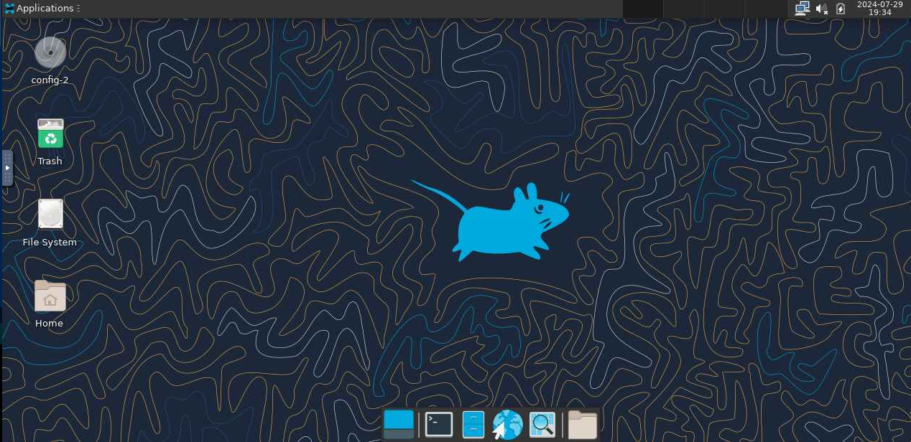

    Play Around.

    No Seriously - Have a play around, explore the space and try to think of whats missing, what you'd like there. Keep some notes and let us know in the feedback form!

    Suggestions:
    - Filesystem: Navigate, create, copy etc.
    - Terminal - Pay attention to where you start (hostname)
    - Environment Variables
    - Software
    - Explore the Settings on the Left-Hand-Side Pop-tab.

        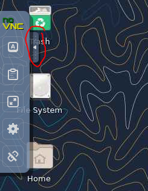
    
3. Disconnecting or Ending Session

    When you want to end your session, but leave the remote-desktop running, simply exit the tab.

    You can resume right where you left off by re-launching the connection from your Interactive Applications page.

    You can permenantly end the session by clicking your Username -> Logout.

    This will eventually complete the Remote Desktop Job and should look like:

    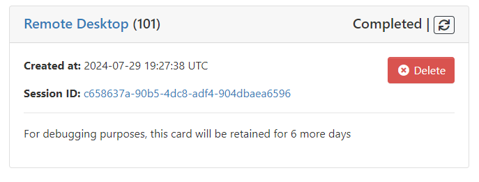

    If you want to re-launch it because you closed it by mistake simply click the relaunch button 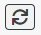.

    If you want to clear the job - click delete - otherwise it will be cleared automatically in 6 days.

(<a href="#top">back to top</a>)

## Jupyter Notebook

If you are not familair with Python - do not worry - we are just using Jupyter as an example for custom envs which R etc can be used with as well.

If you are not familair - Jupyter is a development environment with run-time execution via "Cells" (json objects for the front-end devs in the room). They also provide a Markdown syntax and PDF export - making them rather useful for new coders, and report generators. 

### Starting the Notebook

1. Requesting A Jupyter App Session

    I am once again asking you to navigate to the Interactive Apps page. 

    Click the Servers -> Jupyter Notebook in the left hand pane (lab is an option once the server starts).

    You should have something like this:
    
    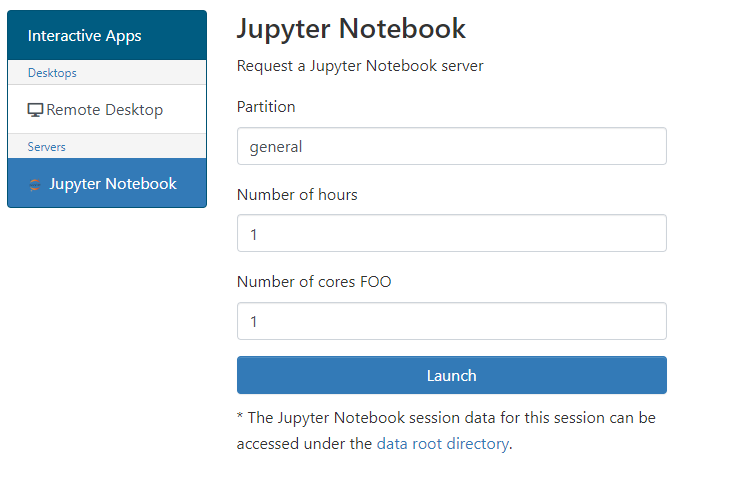

    Dont worry about the `FOO`, the Jupyter Service was recently being played with by the coolest research computing team member... 👀 

    For now - don't change anything and click Launch - you should have the screen show:

    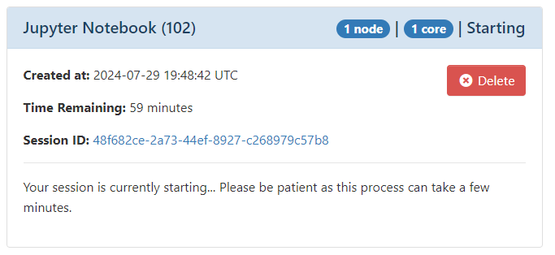

    Which hopefully looks familiar from the Remote Desktop Launch.

    Currently we don't have naming added to look for specific services so take note of the session ID for your session for now.

    Eventually the screen should look like:

    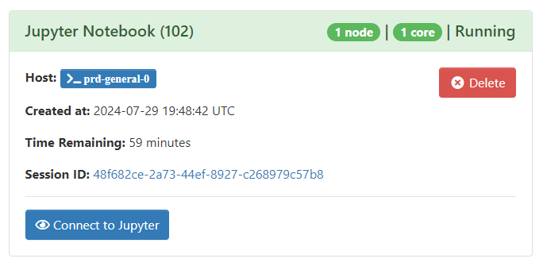

2. Connecting to the Jupyter Notebook

    Click the button.

    No ssh tunnel

    No port forwarding

    No hanging ports from before because Macs don't turn off properly and now its a headace...

    Simples.

    You should have something that looks like:

    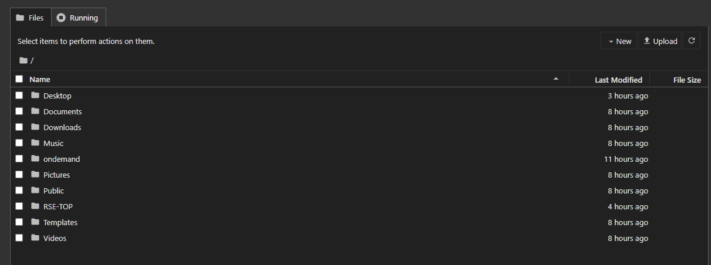

3. Create a Notebook

    Navigate to your `workdir` you create from Exercise 1.

    Using New -> New Folder: Create a new folder called `Jupyter`.

    Using New -> Notebook: Start the default Kernel and a Jupyter Notebook and Kernel.

    You should now have a Jupyter Notebook running, with the default Ipython Kernel called `Untitled.ipynb`.

    To Rename the notebook file click `Untitled` and you'll have a prompt appear to rename it to something useful. Please do so to avoid conflicts.

    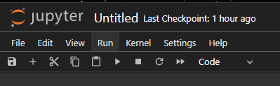

(<a href="#top">back to top</a>)

### Creating A Custom Kernel

One of the important difference between the Artemis HRC Jupyter Notebooks and your laptop is version maintence. We will be updating the App, packages and libraries. 

This WILL break code.

You should always rely on your own environment or a module loaded by the `module load` command.

|  ⚠️ Warning ⚠️  |
| :-----------: |
| **IMPORTANT:** Do not do these steps today - these are for when you have your own user account. These steps were already performed for you. |

4. Start a Compute Session

    Leaving you Jupyter Notebook session running, in another tab navigate to the Dashboard.

    Start an interactive session:
    - Click Cluster -> prd Shell Access.
    - `srun --pty bash -l`

5. Init Conda and Create Env

    This is pretty much step by step to create your own Python environment on the HRC. Again - Dont actually run this.

    - `module load Anaconda3/2024.02-1`
    - `conda init`
    - `module load proxy/public`
    - `conda create -y --name Py3.10-Python numpy scipy jupyter ipython`
    - `conda activate Py3.10-Python`

6. Install Kernel

    This is the magic which will make your user environment available to the Jupyter App. AGAIN dont actually run this.

    - `python -m ipykernel install --user --name Py3.10-Python --display-name "Python (Py3.10)"`

7. Clean Up

    Exit the Interactive Session and Close the Tab

    We want to free up the resources for other users now.

### Connecting to your Kernel

There is now a kernel which you can `pip install` python packages to.

7. Connect the Kernel

    In your Jupyter Session - click the Kernel button in the top right.

    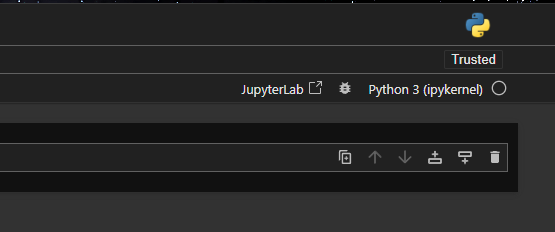

    This will give you a new drop down - where you should see the another kernel besides the default.

    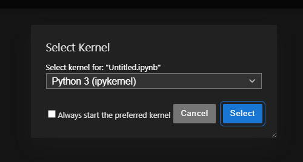

    If you select the checkbox - the next time you start Jupyter this kernel will be loaded by default:

    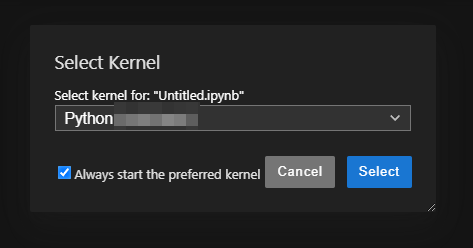

(<a href="#top">back to top</a>)

### Stopping

Simply Exiting your Notebook will not stop the session or Kernel.

Or if you have started multiple notebook - you might need to clean up your environment.

8. Stoping Running Kernels

    In the Jupyter Home File Browser Tab:

     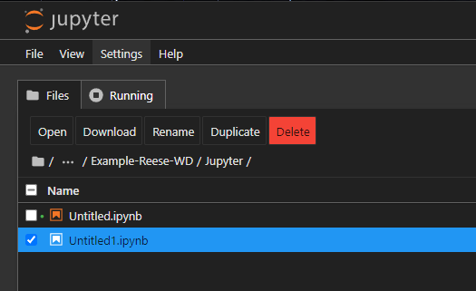

    Click the `Running` Tab - And you can individually or group Kill running kernels.

9. Ending your session

    Simply Exit all your Jupyter Tabs.

    The Interactive Applications page from the Dashboard will show your Jupyter Notebook Job as completed. Once again you can simply hit the relaunch   Icon to start a new session.

    Deleting the Session will not delete your files. And the job session will be deleted in 6 days automatically.

(<a href="#top">back to top</a>)

## Summary

You should now have a good understanding of launching two interactive application from the Open OnDemand Interactive Applications Service.

You should also feel comfortable:

- Creating Environments:
    - Understanding you'll need to load modules or personal environments when using the HRC
    - Creating XFCE Desktop Sessions
    - Navigating the Remote Desktop - Including Remote Mounts
    - Terminating Sessions
- Starting Jupyter Notebooks and Lab servers.
- Creating Kernels to be used by the Applications Launched from the Portal
- Clearing up resources when not in use to apply fair use.
- Navigating and Creating Files within the Jupyter File Explorer.
- Changing, Starting, Stopping Kernels.

|  🎉 🎉 🎉 Congratualtions 🎉 🎉 🎉 |
| :-----------: |
| This is the End of the RSE Workshop.   However the RC-Workshops Repo will be updated contiually and you may find new tutorials. There will be more session run on Artemis and the HRC in the coming months.   Check the Slack `#hpc-workshop` channel for details |

<!-- MARKDOWN LINKS & IMAGES -->
<!-- https://www.markdownguide.org/basic-syntax/#reference-style-links -->
[contributors-shield]: https://img.shields.io/github/contributors/universityofsussex-its/RC-Workshops.svg?style=for-the-badge
[contributors-url]: https://github.com/universityofsussex-its/RC-Workshops/graphs/contributors
[forks-shield]: https://img.shields.io/github/forks/universityofsussex-its/RC-Workshops.svg?style=for-the-badge
[forks-url]: https://github.com/universityofsussex-its/RC-Workshops/network/members
[stars-shield]: https://img.shields.io/github/stars/universityofsussex-its/RC-Workshops.svg?style=for-the-badge
[stars-url]: https://github.com/universityofsussex-its/RC-Workshops/stargazers
[issues-shield]: https://img.shields.io/github/issues/universityofsussex-its/RC-Workshops.svg?style=for-the-badge
[issues-url]: https://github.com/universityofsussex-its/RC-Workshops/issues